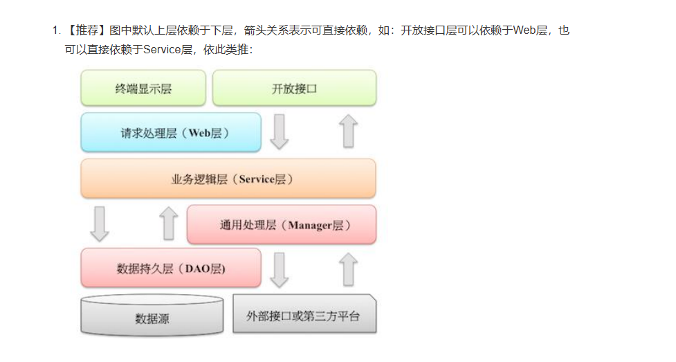

# 应用分层
## 1. 应用分层结构


按照《阿里巴巴Java开发手册》中推荐，业务应该按照上图做划分。

* 开放接口层：可直接封装Service方法暴露成RPC接口；通过Web封装成http接口；进行网关安全控制、流量控制等。
* 终端显示层：各个端的模板渲染并执行显示的层。当前主要是velocity渲染，JS渲染，JSP渲染，移动端展示等。
* Web层：主要是对访问控制进行转发，各类基本参数校验，或者不复用的业务简单处理等。(Controller层)
* Service层：相对具体的业务逻辑服务层。(Service层 组装业务)
* Manager层：通用业务处理层，它有如下特征：（负责数据层逻辑 访问数据库等操作）

  1） 对第三方平台封装的层，预处理返回结果及转化异常信息；

  2） 对Service层通用能力的下沉，如缓存方案、中间件通用处理；

  3） 与DAO层交互，对多个DAO的组合复用。

分层结构
```scss
Controller  (对外暴露接口)
↓
Service  (作为业务逻辑的统一入口)
↓
Manager  (具体的业务实现、数据拼装)
↓
DAO  (数据库访问)

Service层之间可以相互调用，Manager层之间可以相互调用
自身的Service层不应该直接访问其他Service的Manager层，Manager层是自身service的实现
```
## 2. 分层实战
### 2.1 分层的目录架构
```shell
com.example.usermanagement
├── controller       # Web 层
│   ├── UserController.java
│   ├── UserRpcServiceImpl.java (RPC接口)
│
├── service          # Service 层
│   ├── UserService.java
│   ├── UserServiceImpl.java
│
├── manager         # Manager 层
│   ├── UserManager.java
│
├── dao             # DAO 层
│   ├── UserDao.java
│
├── dto             # 数据传输
│   ├─ UserDTO.java
├── model           # 数据模型
│   ├── User.java
│
├── rpc             # RPC 层（如 Dubbo、gRPC）
│   ├── UserRpcService.java
│
├── UserManagementApplication.java

```
### 2.2 模型层
```java
package com.example.usermanagement.model;

import lombok.Data;

@Data
public class User {
    private Long id;
    private String name;
    private Integer age;
}

```

### 2.3 DAO 层
```java
package com.example.usermanagement.dao;

import com.example.usermanagement.model.User;
import org.springframework.stereotype.Repository;

import java.util.HashMap;
import java.util.Map;

@Repository
public class UserDao {
    private static final Map<Long, User> userDb = new HashMap<>();

    public User getUserById(Long id) {
        return userDb.get(id);
    }

    public void saveUser(User user) {
        userDb.put(user.getId(), user);
    }
}
```

### 2.4 Manager 层
```java
package com.example.usermanagement.manager;

import com.example.usermanagement.dao.UserDao;
import com.example.usermanagement.model.User;
import org.springframework.beans.factory.annotation.Autowired;
import org.springframework.stereotype.Component;

@Component
public class UserManager {

    @Autowired
    private UserDao userDao;

    public User getUser(Long id) {
        return userDao.getUserById(id);
    }

    public void createUser(User user) {
        // 这里可以加缓存、日志处理、异常转换等
        userDao.saveUser(user);
    }
}

```

### 2.5 Service 层
```java
package com.example.usermanagement.service;

import com.example.usermanagement.model.User;

public interface UserService {
    User getUserById(Long id);
    void createUser(User user);
}

```
```java
package com.example.usermanagement.service.impl;

import com.example.usermanagement.manager.UserManager;
import com.example.usermanagement.model.User;
import com.example.usermanagement.service.UserService;
import org.springframework.beans.factory.annotation.Autowired;
import org.springframework.stereotype.Service;

@Service
public class UserServiceImpl implements UserService {

    @Autowired
    private UserManager userManager;

    @Override
    public User getUserById(Long id) {
        return userManager.getUser(id);
    }

    @Override
    public void createUser(User user) {
        userManager.createUser(user);
    }
}

```
### 2.6 web层
```java
package com.example.usermanagement.controller;

import com.example.usermanagement.model.User;
import com.example.usermanagement.service.UserService;
import org.springframework.beans.factory.annotation.Autowired;
import org.springframework.web.bind.annotation.*;

@RestController
@RequestMapping("/users")
public class UserController {

    @Autowired
    private UserService userService;

    @GetMapping("/{id}")
    public User getUser(@PathVariable Long id) {
        return userService.getUserById(id);
    }

    @PostMapping("/")
    public String createUser(@RequestBody User user) {
        userService.createUser(user);
        return "User created successfully!";
    }
}

```

* DAO 层：直接与数据库交互，存取 User 数据。
* Manager 层：封装数据库操作，提供更高级的业务逻辑，如异常处理、缓存等。
* Service 层：提供具体的业务实现，调用 Manager 层。
* Web 层：提供 HTTP 接口，调用 Service 层。
* RPC 层：通过 Dubbo 暴露远程调用接口，允许其他服务调用。


你可以根据业务需求进一步完善，如：
* 增加 缓存（Redis）
* 细化 异常处理
* 引入 限流、熔断 机制（Sentinel）
这种分层方式适用于 中大型微服务架构，有助于 代码解耦、职责清晰。


## 3. Manager层与Service层之间的划分和关系
### 3.1 职能划分
✅ Manager 层（通用业务处理层）
* 提供对 Service 层的通用能力下沉（例如缓存、远程调用、事务包装等）。
* 封装跨 DAO 的组合逻辑。
* 与 DAO 层交互，提供更高级的通用能力。
* 不对外提供业务接口！

负责数据库访问、DAO 操作, 不能 执行业务逻辑（如发送邮件、日志记录等）.

✅ Service 层（相对具体的业务逻辑服务层）

* 负责核心的业务逻辑和事务管理。
* 对外提供原子化的业务接口（增、删、改、查）。
* 可以调用 Manager 层（但不应该直接操作 DAO 层）。
* 控制事务、流量、幂等、分布式锁等。

调用 UserManager.createUser 来创建用户,负责执行额外业务逻辑（如发送邮件、初始化配置等）,对外暴露的接口，应该使用 Service 而不是 Manager.

### 3.2 为什么推荐 Service 调用 Manager？

✅ 职责更加单一：

Service 专注于业务逻辑。
Manager 专注于通用能力、数据库组合、缓存封装。

✅ 防止 Service 间互相调用：

如果 Service 层直接组合多个 Service，耦合度过高。
通过 Manager 层统一管理多个 DAO 访问，保持 Service 的单一性。

✅ 降低重复代码：

Manager 层可以封装缓存、异常处理、远程调用等。
避免 Service 层反复写这些通用的处理。


### 3.3 为什么不推荐 Manager 调用 Service？
❌ 如果让 Manager 调用 Service，会带来几个严重问题：

1️⃣ 循环依赖问题：

Service 调用 Manager，但如果 Manager 也调用 Service，就形成了循环依赖，Spring 无法正常初始化。

2️⃣ 职责混乱：

Service 层就无法保持原子性，它变成了既有业务逻辑，又有数据拼装，导致代码复杂度上升。

🚫 不推荐做法
❌ 1. 让 UserManager 直接执行所有业务逻辑
如果 UserManager.createUser 直接发送邮件、初始化用户等，就会导致数据逻辑与业务逻辑混合，这样 OrderService 只想存储用户数据却无故触发了其他业务。

❌ 2. 让 OrderService 直接调用 UserManager
如果 OrderService 直接调用 UserManager.createUser，则 OrderService 不会执行 UserService 里的额外逻辑（如邮件、日志），导致业务不完整。


### 3.4 为什么不建议 Service 直接调用别人的 Manager？
#### 1. 破坏封装性

Manager 层通常是 Service 的实现细节，不应该被外部 Service 直接依赖。
这样如果 Manager 变更，多个 Service 都可能受影响。

#### 2. 可能导致业务逻辑分散
Manager 只处理数据访问，而 Service 负责业务逻辑。
直接调用 Manager 可能导致业务逻辑散落在多个 Service，难以维护。

#### 3. 违反层级依赖
Service 是面向业务逻辑的，而 Manager 是面向数据库的，直接跳过 Service 可能导致职责混乱。

✅ 推荐做法：Service 之间相互调用
1️⃣ 直接调用目标 Service
```shell
@Service
public class OrderService {
    @Autowired
    private UserService userService; // 直接依赖 UserService，而不是 UserManager

    public OrderInfo getOrderWithUser(Long orderId) {
        Order order = orderManager.findById(orderId);
        if (order == null) {
            throw new NotFoundException("Order not found");
        }

        UserInfoDTO userInfo = userService.getUserInfo(order.getUserId()); // 通过 UserService 获取用户信息
        return new OrderInfo(order, userInfo);
    }
}
```
这样 OrderService 依赖 UserService，保持清晰的层级调用。

2.  让目标 Service 提供公用方法
```shell
@Service
public class UserService {
    @Autowired
    private UserManager userManager;

    public UserInfoDTO getUserInfo(Long userId) {
        User user = userManager.findById(userId);
        if (user == null) {
            throw new NotFoundException("User not found");
        }
        return new UserInfoDTO(user);
    }
}
```
👉 这样别的 Service 需要用户信息时，只需调用 UserService#getUserInfo，不直接访问 UserManager。

### 3.5  什么时候用 Service 调用 Manager，什么时候用 Service 调用 Service
1️⃣ 使用 Service 调用 Manager：
* 当你的 Service 需要对数据进行增删改查操作时，应该通过调用 Manager 层 来完成这些操作。 Manager 层负责数据访问与处理，而 Service 层负责业务逻辑的实现。
* 例如，UserService 调用 UserManager 来获取用户数据，OrderService 调用 OrderManager 来处理订单数据。


2️⃣ 使用 Service 调用 Service：
* 当你的 业务逻辑 涉及到多个领域或业务模块时，Service 层应该调用其他 Service 层提供的接口 来协同工作。
* 例如，OrderService 调用 UserService 来获取用户信息，处理订单时需要将多个业务模块的数据组合到一起。

🔥 总结
方案	是否推荐	说明
Service A 调用 Service B	✅ 推荐	业务逻辑清晰，保证封装性

Service A 直接调用 Service B 的 Manager	❌ 不推荐	破坏封装，导致维护困难

Service A 直接访问 Service B 的 DAO	❌ 极不推荐	破坏架构，影响数据一致性

所以，Service 之间调用时，建议调用目标 Service 而不是 Manager，这样可以保证代码清晰、解耦，并方便维护。 🚀

``


### 3.6 不同的界面需求不同 需要返回不同的结果需要怎么设计？
#### 方案1 前端调用不同的 API
如果两套前端页面需求差异较大，可以提供不同的接口，避免 if-else 过多：
```java
@RestController
@RequestMapping("/api/user")
public class UserController {
    @Autowired
    private UserService userService;

    // 提供给页面 A
    @GetMapping("/{userId}/with-orders")
    public UserInfoDTO getUserWithOrders(@PathVariable Long userId) {
        return userService.getUserWithOrders(userId);
    }

    // 提供给页面 B
    @GetMapping("/{userId}/with-tags")
    public UserInfoDTO getUserWithTags(@PathVariable Long userId) {
        return userService.getUserWithTags(userId);
    }
}

```

### 方案2 前端传递 viewType，后端根据参数返回不同的数据 
```java
@Service
public class UserService {
    @Autowired
    private UserManager userManager;
    @Autowired
    private OrderService orderService;
    @Autowired
    private UserTagService userTagService;

    public UserInfoDTO getUserInfo(Long userId, String viewType) {
        User user = userManager.findById(userId);
        if (user == null) {
            throw new NotFoundException("User not found");
        }

        UserInfoDTO dto = new UserInfoDTO(user);

        // 根据 viewType 添加不同的内容
        if ("pageA".equals(viewType)) {
            dto.setOrders(orderService.getRecentOrders(userId));
        } else if ("pageB".equals(viewType)) {
            dto.setTags(userTagService.getUserTags(userId));
        }

        return dto;
    }
}
```

如果只是返回数据不同，结构类似 ➝ 方案 2（viewType 参数）

如果业务逻辑差异较大 ➝ 方案 1（不同 API）


方案 2（参数 viewType）	适用于接口结构类似，数据内容有差异的情况	
1. 复用 API，减少代码重复
2. 易于扩展	

1. 需要处理 if-else 逻辑
2. 可能会影响性能（返回多余数据）

方案 1（不同 API）	适用于业务逻辑完全不同的情况	
1. API 设计清晰
2. 性能更好（只返回需要的数据）	
3. 可能会有代码重复
4. 需要维护多个 API